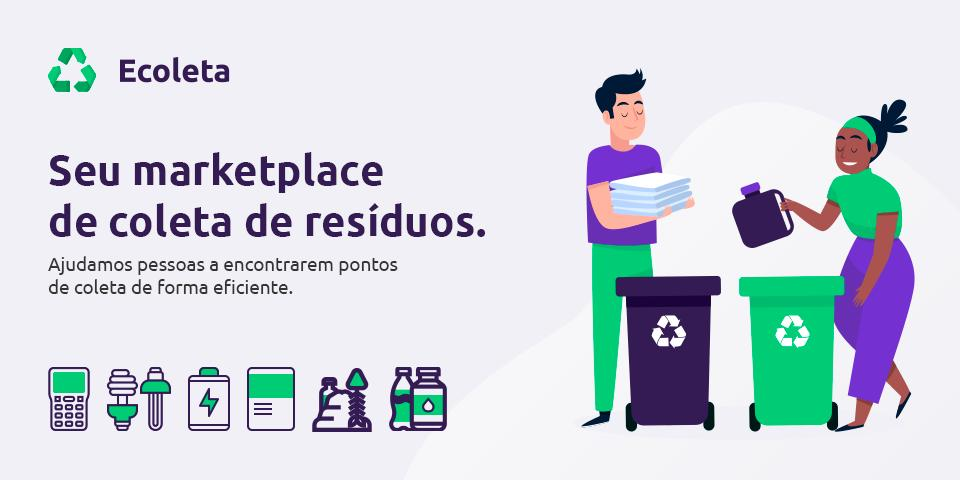
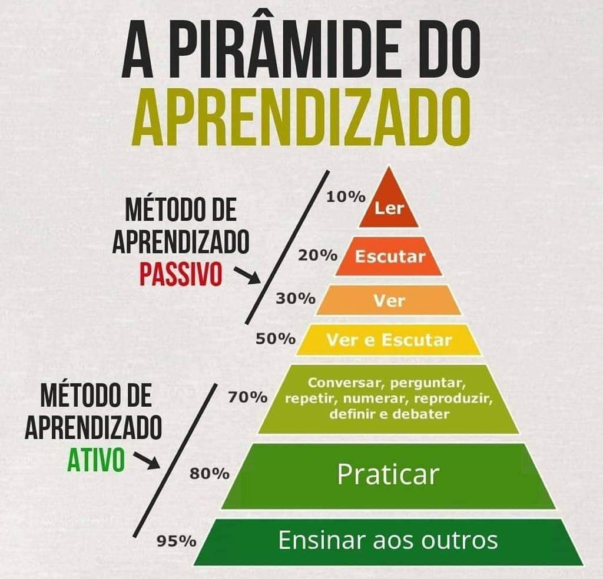

<h1 align="center">
    Ecoleta - Projeto do Next Level Week da RocketSeat.
</h1>

<h4 align="center">
  Essa aplicação funciona como um midware entre empresas/entidades que coletam resíduos orgânicos e inorgânicos e as pessoas que precisam descartar esses resíduos.
</h4>

  

  

  
  

  

  

  <a href="#rocket-tecnologias-e-recursos">Tecnologias e Recursos</a>&nbsp;&nbsp;&nbsp;|&nbsp;&nbsp;&nbsp;
  <a href="#information_source-sobre">Sobre</a>&nbsp;&nbsp;&nbsp;|&nbsp;&nbsp;&nbsp;
  <a href="#memo-licença">Licença</a>

## :rocket: Tecnologias e Recursos

- [React][rct] - `Biblioteca JavaScript de código aberto com foco em criar interfaces de usuário em páginas web.`
- [React Native][rctn] - `Biblioteca Javascript criada pelo Facebook. É usada para desenvolver aplicativos para os sistemas Android e IOS de forma nativa.`
- [TypeScript][ts] - `Superconjunto de JavaScript desenvolvido pela Microsoft que adiciona tipagem e alguns outros recursos a linguagem.`
- [Node.js][njs] - `Um ambiente de execução Javascript server-side.`
- [Knex.js][kjs] - `Construtor de consultas SQL utilizando JavaScript - semelhante ao uso de LINQ em C# - com suporte para Postgres, MSSQL, MySQL, MariaDB, SQLite3, Oracle e Amazon Redshift, criado para ser flexível, portátil e divertido de usar.`
- [SQLite][sql] - `Biblioteca em linguagem C que implementa um banco de dados SQL embutido.`
- [ECMAScript][es] - `Especificação de linguagem de programação baseada em scripts que o JavaScript implementa, padronizada pela Ecma International. Trás uma sintaxe mais flexível, enxuta e fácil de se aprender e trabalhar.`
- [Leaflet][lf] - `Biblioteca JavaScript de código aberto amplamente usada para criar aplicativos de mapeamento da web.`
- [React Leaflet][rlf] - `Abstração do Leaflet como componentes React.`
- [IBGE API v1.0][rlf] - `Documentações e APIs fornecidas pelo Instituto Brasileiro de Geografia e Estatistica - IBGE, principal provedor de informações geográficas e estatísticas do Brasil.`
- [React Icons][ric] - `Permite o uso de ícones populares utilizando importações do ES6 que permitem incluir apenas os ícones que o seu projeto está usando.`
- [Axios][axios] - `Cliente HTTP que funciona tanto no browser quanto em node.js`
- [VS Code][vc] with [EditorConfig][vceditconfig] and [ESLint][vceslint] - `O VS Code é um editor Open Source da Microsoft. O EditorConfig ajuda a manter estilos de codificação consistentes para vários desenvolvedores que trabalham no mesmo projeto em vários editores e IDEs e o ESLint ajuda na análise de código estática para identificar padrões problemáticos encontrados no código JavaScript.`

## :information_source: Sobre

  

Aplicação web e mobile voltada para fins ecológicos, e que surgiu para apoiar a semana internacional do Meio Ambiente que acontece justamente nessa semana.

O projeto Next Level Week, é uma experiência única com muito conteúdo prático, desafios, promovida pelo Diego Fernandes da Rocketseat, e tem como base 3 pilares:

1. Foco - Ser objetivo e evitar distrações, resolvendo problemas e gerando valor com escolhas mais conscientes e efetivas.

2. Prática - Acumular experiência e saber o momento certo de aplicar a teoria de forma eficiente. A prática auxilia a tomada de decisões, e torna a pessoa cada vez mais segura.

3. Grupo - Se aproximar de profissionais com objetivos em comum, trocar experiências e compartilhar conhecimento é fundamental.

A ideia desse pilares é semelhante com a [Pirâmide de Aprendizado de William Glasser](https://pt.wikipedia.org/wiki/Pirâmide_de_aprendizagem), que nos dizia através de um estudo que:

> Depois de duas semanas, o cérebro humano lembra 10% do que leu; 20% do que ouviu; 30% do que viu; 50% do que viu e ouviu; 70% do que disse em uma conversa/debate; e 90% do que vivenciou a partir de sua prática.

  

## :memo: Licença

Este projeto está sob a licença do MIT. Veja a [LICENÇA](https://github.com/jvidaln/jvidaln.github.io/blob/master/LICENSE) para mais informações.

---

Feito com ♥ por Jean Vidal :wave: [Entre em contato!](https://www.linkedin.com/in/jvidalnunes/)

[vc]: https://code.visualstudio.com/
[vceditconfig]: https://marketplace.visualstudio.com/items?itemName=EditorConfig.EditorConfig
[vceslint]: https://marketplace.visualstudio.com/items?itemName=dbaeumer.vscode-eslint
[es]: https://www.ecma-international.org
[rct]: https://pt-br.reactjs.org
[rctn]: https://reactnative.dev
[ts]: https://www.typescriptlang.org
[njs]: https://nodejs.org
[kjs]: http://knexjs.org
[sql]: https://www.sqlite.org/index.html
[lf]: https://leafletjs.com/
[rlf]: https://react-leaflet.js.org
[ibge]: https://servicodados.ibge.gov.br/api/docs
[ric]: https://react-icons.github.io/react-icons/
[axios]: https://github.com/axios/axios
